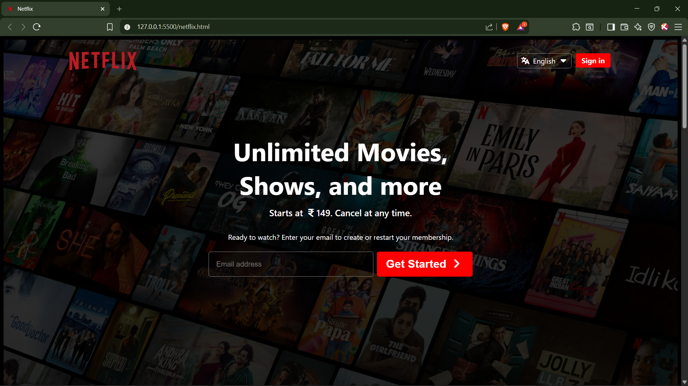
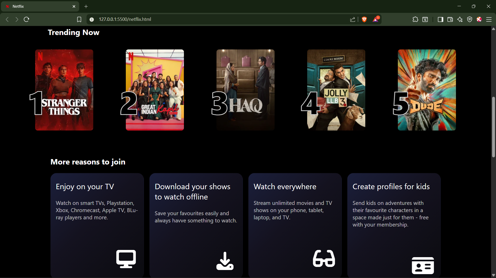
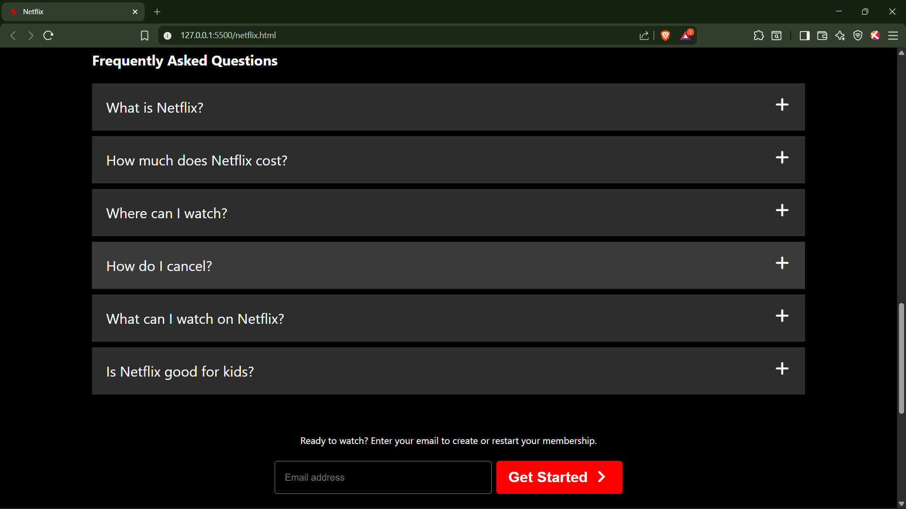

# 🎬 Netflix Clone (HTML & CSS)

A responsive **Netflix landing page clone** built using **pure HTML and CSS**.  
This project focuses on layout design, gradients, overlays, and modern UI styling inspired by Netflix.

---

## 🚀 Project Overview

This project recreates the look and feel of Netflix’s landing page to practice real-world frontend development concepts such as layout structuring, image overlays, and gradient effects.

The main goal was to improve UI accuracy and CSS confidence by cloning a popular production-level website.

---

## 📷 Screenshots

### Homepage

---

## 🛠️ Tech Stack

- **HTML5**
- **CSS3**
- **Font Awesome** (icons)

> No JavaScript or frameworks used — built completely from scratch.

---

## ✨ Features

- 🎥 Netflix-style **hero section** with background image & gradient overlay  
- 🔢 **Trending section** with poster ranking numbers (overlapping effect)  
- 🎨 Gradient-based **“More reasons to join”** cards  
- 📩 Email input call-to-action section  
- ❓ FAQ section inspired by Netflix UI  
- 🖼️ Proper favicon & SVG logo integration  

---

## 📂 Folder Structure

netflix-clone/
│── netflix.html
│── netflix.css
│── images/
│ ├── netflix-background.jpg
│ ├── netflix-logo.svg
│ ├── Netflix_Symbol_RGB.png
│ ├── trending-1.webp
│ ├── trending-2.webp
│ ├── trending-3.webp
│ ├── trending-4.webp
│ └── trending-5.webp

---

## 📸 Preview

> UI inspired by Netflix (created for learning and practice purposes).

---

## 📈 Learning Outcomes

- Stronger understanding of **CSS positioning & z-index**
- Implementing **linear-gradient overlays**
- Image and text overlapping techniques
- Structuring real-world landing pages
- Improved frontend styling skills

---

## ⚠️ Disclaimer

This project is created **only for educational purposes**.  
All images, logos, and brand references belong to **Netflix**.

---

## 🙌 Feedback & Contributions

Suggestions and improvements are always welcome.  
Feel free to fork the repository or raise an issue.

⭐ If you like this project, don’t forget to star the repo!
